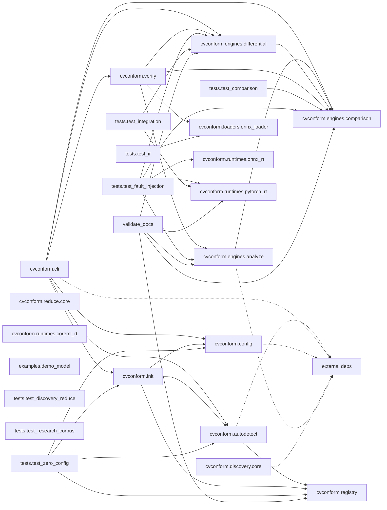

# Architecture — `cvconform`

> Auto-generated by `repo-archaeologist`. Heuristic; treat as a starting map, not ground truth.

## Tech Stack

| Language | LOC | Share |
|---|---:|---:|
| Python | 4,124 | 100.0% |

**Total source LOC:** 4,124 across 36 source files (43 files total).

## Entry Points

- `cvconform/cli.py`

## Dependencies

_No dependency manifests detected (no requirements.txt, pyproject.toml, package.json, go.mod, Cargo.toml, or Gemfile)._

## Top-Level Layout

```
cvconform/
- cvconform/  (27 source files)
- docs/
- examples/  (1 source files)
- tests/  (7 source files)
- .pre-commit-config.example.yaml
- .pre-commit-hooks.yaml
- CHANGELOG.md
- README.md
- pyproject.toml
- validate_docs.py
```

## Module Breakdown

| Directory | Source files |
|---|---:|
| cvconform | 27 |
| tests | 7 |
| validate_docs.py | 1 |
| examples | 1 |

## Dependency Diagram

_Best-effort module dependency graph from static imports. Local modules only; external dependencies are collapsed._



## Dead Code Estimate

**4 module(s) appear unreferenced** out of 17 candidate(s). These are source files no other file imports or requires. Verify before deleting — dynamic imports and entry points may not be detected.

| File | Language |
|---|---|
| `cvconform/cli.py` | Python |
| `cvconform/runtimes/coreml_rt.py` | Python |
| `examples/demo_model.py` | Python |
| `validate_docs.py` | Python |

## Largest Source Files

| File | LOC |
|---|---:|
| cvconform/verify.py | 400 |
| cvconform/engines/comparison.py | 281 |
| cvconform/ir/__init__.py | 234 |
| cvconform/cli.py | 205 |
| cvconform/engines/analyze.py | 202 |
| cvconform/loaders/onnx_loader.py | 199 |
| validate_docs.py | 190 |
| cvconform/engines/differential.py | 176 |
| cvconform/autodetect.py | 172 |
| cvconform/registry.py | 136 |

## Project Hygiene

| Signal | Status |
|---|---|
| README | present |
| LICENSE | **missing** |
| CI config | present |
| Dockerfile | absent |
| Lockfile | **missing** |
| Tests | detected |
